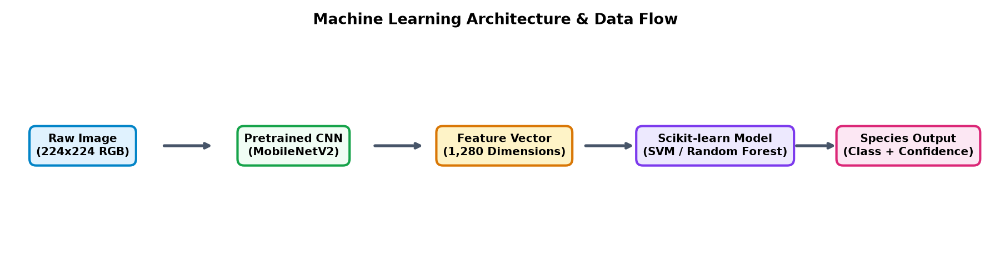
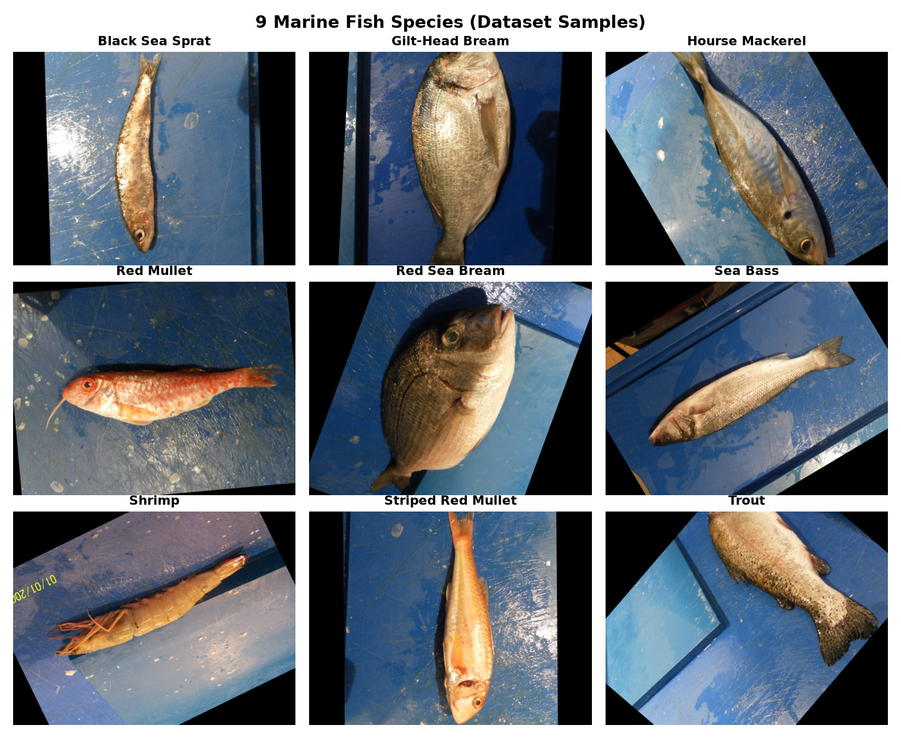
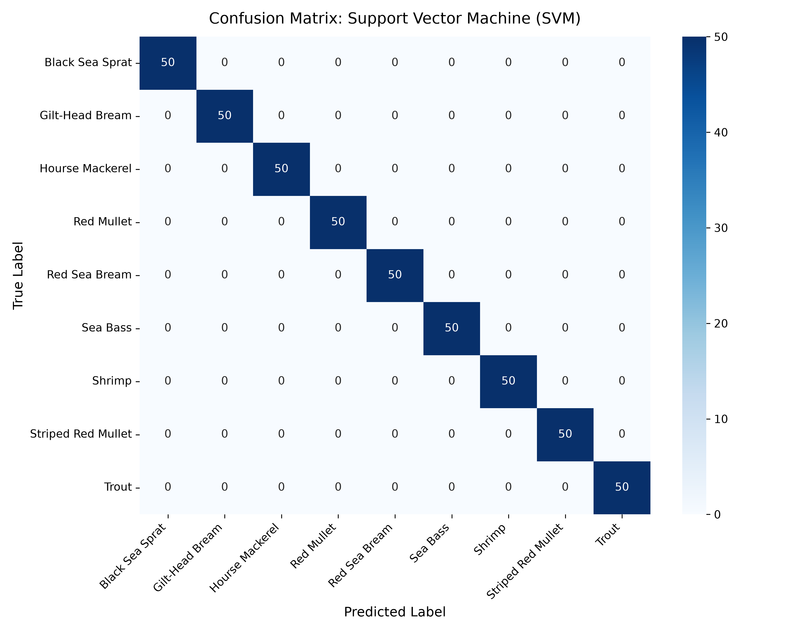
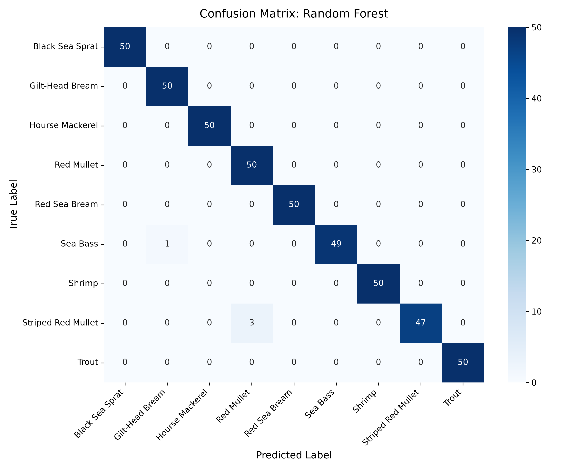

# Marine Fish Species Classification System 🐟

[](https://www.python.org/)
[](https://scikit-learn.org/)
[](https://pytorch.org/)
[]()
[]()

โครงงานวิชา **Machine Learning Mini Project**: ระบบวิเคราะห์และจำแนกสายพันธุ์ปลาและสัตว์น้ำทะเลจากภาพถ่ายด้วยการเรียนรู้ของเครื่อง (Supervised Multi-class Classification) 

---

## 1. ภาพรวมสถาปัตยกรรมระบบ (Architecture & Data Flow)

ระบบใช้สถาปัตยกรรม **Hybrid Machine Learning** โดยใช้โครงข่าย **MobileNetV2 (Pretrained CNN)** ทำหน้าที่สกัดคุณลักษณะระดับลึก (Deep Feature Extraction) ขนาด 1,280 มิติ และส่งต่อให้ขั้นตอนวิธีของ **Scikit-learn (SVM & Random Forest)** ทำหน้าที่จำแนกประเภทตามข้อกำหนดของโครงงาน

<div align="center">
  
</div>

```
Input Image (224×224) ──► MobileNetV2 (Headless) ──► 1,280-d Feature Vector ──► StandardScaler ──► SVM / Random Forest ──► Predicted Species
```

---

## 2. ชุดข้อมูล (Dataset Overview)

ชุดข้อมูลที่ใช้มาจาก **[A Large Scale Fish Dataset](https://www.kaggle.com/datasets/crowww/a-large-scale-fish-dataset)** บน Kaggle ประกอบด้วยสัตว์น้ำและปลาทะเลจำนวน 9 สายพันธุ์เศรษฐกิจ โดยทำการสุ่มคลาสละ 250 ภาพ (รวม 2,250 ภาพ) เพื่อความสมดุลและความรวดเร็วในการประมวลผล:

<div align="center">
  
</div>

| # | ชื่อภาษาอังกฤษ (English Name) | ชื่อภาษาไทย (Thai Name) | วงศ์ทางอนุกรมวิธาน (Family) | เกรดทางการค้า (Market Profile) |
|---|---|---|---|---|
| 1 | **Black Sea Sprat** | ปลาสเปรตทะเลดำ | *Clupeidae* | ปลาแปรรูปอุตสาหกรรม / โอเมก้า 3 สูง |
| 2 | **Gilt-Head Bream** | ปลากะพงทรายสีทอง (โดราด) | *Sparidae* | ปลาเศรษฐกิจเกรดพรีเมียม (High Value) |
| 3 | **Hourse Mackerel** | ปลาทูแขก หรือ ปลาอาจิ | *Carangidae* | ปลาสดพาณิชย์ / ตลาดปลาซาชิมิ |
| 4 | **Red Mullet** | ปลาบาร์บูนแดง | *Mullidae* | ปลาธรรมชาติหายาก / ภัตตาคารซีฟู้ด |
| 5 | **Red Sea Bream** | ปลากะพงแดงญี่ปุ่น (ปลามาได) | *Sparidae* | ปลามงคลเกรดประมูล (ราชาแห่งปลาเนื้อขาว) |
| 6 | **Sea Bass** | ปลากะพงขาวเมดิเตอร์เรเนียน | *Moronidae* | ปลาตลาดสากลยอดนิยม (Branzino) |
| 7 | **Shrimp** | กุ้งทะเล / กุ้งน้ำกร่อย | *Penaeidae* | สินค้าสัตว์น้ำส่งออกอันดับหนึ่ง |
| 8 | **Striped Red Mullet** | ปลาบาร์บูนแดงลายแถบ | *Mullidae* | ปลาเกรดภัตตาคารชั้นนำ (Surmullet) |
| 9 | **Trout** | ปลาเทราต์ (เรนโบว์เทราต์) | *Salmonidae* | ปลาเศรษฐกิจน้ำเย็น / ทางเลือกทดแทนแซลมอน |

---

## 3. ระเบียบวิธีและการเตรียมข้อมูล (Methodology & Preprocessing)

1. **Image Resizing:** ปรับขนาดภาพทุกภาพเป็น $224 \times 224$ pixels เพื่อให้สอดคล้องกับขนาดมาตรฐานของ MobileNetV2
2. **ImageNet Normalization:** ปรับมาตรฐานค่าสีตามสถิติของ ImageNet ($\mu = [0.485, 0.456, 0.406]$, $\sigma = [0.229, 0.224, 0.225]$)
3. **Feature Extraction:** ตัด Classifier Head ของ MobileNetV2 ออก เพื่อดึงเวกเตอร์ขนาด 1,280 มิติ ($X \in \mathbb{R}^{2250 \times 1280}$)
4. **Train / Test Split:** แบ่งชุดข้อมูลฝึกฝน 80% (1,800 ภาพ) และชุดข้อมูลทดสอบ 20% (450 ภาพ) แบบ Stratified
5. **Standard Scaling:** ปรับสเกลข้อมูลคุณลักษณะด้วย `StandardScaler` ($z = (x - \mu) / \sigma$) บน Train Set เพื่อป้องกัน Data Leakage

---

## 4. ผลการทดลองและการเปรียบเทียบโมเดล (Experimental Results)

ทำการฝึกฝนและเปรียบเทียบโมเดล **Scikit-learn** จำนวน 2 โมเดลตามเกณฑ์การประเมิน:

| ขั้นตอนวิธี (Algorithm) | Test Accuracy | Precision (Weighted) | Recall (Weighted) | F1-Score (Weighted) | เวลาฝึกฝน (วินาที) |
|---|:---:|:---:|:---:|:---:|:---:|
| **Support Vector Machine (SVM)** | **100.00%** | **100.00%** | **100.00%** | **100.00%** | 3.12 s |
| **Random Forest Classifier** | **99.11%** | **99.15%** | **99.11%** | **99.11%** | 0.39 s |

* **Final Model Selection:** เลือก **Support Vector Machine (SVM)** ด้วย RBF Kernel ($C=10.0$) เนื่องจากสามารถจำแนกชุดข้อมูลทดสอบทั้ง 450 ตัวอย่างได้อย่างสมบูรณ์แบบ

### แผนภาพเมทริกซ์ความสับสน (Confusion Matrices)

<div align="center">
  <table>
    <tr>
      <td align="center"><b>Support Vector Machine (SVM)</b></td>
      <td align="center"><b>Random Forest Classifier</b></td>
    </tr>
    <tr>
      <td></td>
      <td></td>
    </tr>
  </table>
</div>

---

## 5. เว็บแอปพลิเคชัน (Web Applications)

โปรเจกต์นี้พัฒนาเว็บแอปพลิเคชันหน้าเดียว (Single-page Application) ให้เลือกใช้งาน 2 รูปแบบตามความเหมาะสม:

### ตัวเลือกที่ 1: Fishery Marine Intelligence (Flask + Tailwind CSS + DaisyUI)
* **พอร์ต:** `http://localhost:5000`
* **คำสั่งรัน:**
  ```powershell
  .\.venv\Scripts\python.exe app_flask.py
  ```
* **จุดเด่น:** ดีไซน์สไตล์งานประมงและสะพานปลา สวยงาม คลีน เป็นมิตรต่อผู้ใช้งาน มีกล่อง Drag & Drop (รองรับการแตะถ่ายภาพจากกล้องมือถือ/แท็บเล็ต), แกลเลอรีภาพตัวอย่างปลา 9 ชนิด, และปุ่มสลับโมเดล **SVM vs Random Forest** ได้แบบ Real-time

### ตัวเลือกที่ 2: Scientific Dashboard (Streamlit)
* **พอร์ต:** `http://localhost:8501`
* **คำสั่งรัน:**
  ```powershell
  .\.venv\Scripts\streamlit run app.py
  ```
* **จุดเด่น:** สไตล์แดชบอร์ดงานวิจัย แสดงตารางวิเคราะห์ความน่าจะเป็น และข้อมูลอนุกรมวิธานอย่างเป็นทางการ

---

## 6. โครงสร้างไฟล์ในโปรเจกต์ (Project Structure)

```text
├── assets/                          # รูปภาพประกอบและแผนผังสำหรับ README
│   ├── confusion_matrix_rf.png
│   ├── confusion_matrix_svm.png
│   ├── pipeline_architecture.png
│   └── species_preview_grid.png
├── model/                           # ไฟล์บันทึกโมเดลที่ฝึกฝนเสร็จสมบูรณ์
│   └── fish_classifier.joblib       # บันทึกทั้ง SVM และ Random Forest พร้อม Scaler
├── reports/                         # รายงานผลการทดลองและไฟล์กราฟสรุป
│   └── evaluation_metrics.json
├── sample_test_images/              # ภาพตัวอย่างปลา 9 ชนิดสำหรับทดสอบด่วน
├── templates/                       # เทมเพลตหน้าเว็บ Flask (Tailwind + DaisyUI)
│   └── index.html
├── .gitignore                       # ละเว้นไฟล์ขนาดใหญ่และ .venv
├── app.py                           # เว็บแอปพลิเคชัน Streamlit
├── app_flask.py                     # เว็บแอปพลิเคชัน Flask (Tailwind + DaisyUI)
├── download_and_sample.py           # สคริปต์ดาวน์โหลดและสุ่มข้อมูลจาก Kaggle
├── fish_classification_pipeline.ipynb # Jupyter Notebook แสดงโฟลการทำงานจริง 7 ขั้นตอน
├── train.py                         # สคริปต์สกัดฟีเจอร์และฝึกฝนโมเดล Scikit-learn
├── requirements.txt                 # รายการแพ็กเกจที่จำเป็น
├── PROJECT_REPORT.md                # ร่างรายงานฉบับสมบูรณ์ (ไม่เกิน 10 หน้า)
└── PRESENTATION_GUIDE.md            # คู่มือการนำเสนอ 10-12 นาที พร้อมขั้นตอน Live Demo
```

---

## 7. วิธีการติดตั้งและเริ่มใช้งาน (Quickstart Guide)

### 1. โคลนคลังข้อมูล (Clone Repository)
```bash
git clone <YOUR_REPOSITORY_URL>
cd <REPOSITORY_NAME>
```

### 2. สร้างและเปิดใช้งาน Virtual Environment
```powershell
# บนระบบปฏิบัติการ Windows
python -m venv .venv
.\.venv\Scripts\activate
```

### 3. ติดตั้งไลบรารีที่จำเป็น
```powershell
pip install -r requirements.txt
```

### 4. รันเว็บแอปพลิเคชัน
```powershell
# เปิดใช้งานเว็บแอปพลิเคชัน Flask (แนะนำ)
python app_flask.py
```
เปิดเบราว์เซอร์ไปที่: `http://localhost:5000`

---

## 8. เอกสารประกอบโครงงาน (Project Deliverables)
* **เล่มรายงานฉบับเต็ม:** อ่านรายละเอียดโครงสร้างเล่มรายงาน 10 หน้าได้ที่ [PROJECT_REPORT.md](PROJECT_REPORT.md)
* **บทพูดนำเสนอและสคริปต์ Live Demo:** อ่านแผนการพรีเซนต์ 10–12 นาทีได้ที่ [PRESENTATION_GUIDE.md](PRESENTATION_GUIDE.md)
* **การทดลองแบบสมบูรณ์:** ดูโค้ดและการรันผลลัพธ์ทีละขั้นตอนได้ที่ [fish_classification_pipeline.ipynb](fish_classification_pipeline.ipynb)
